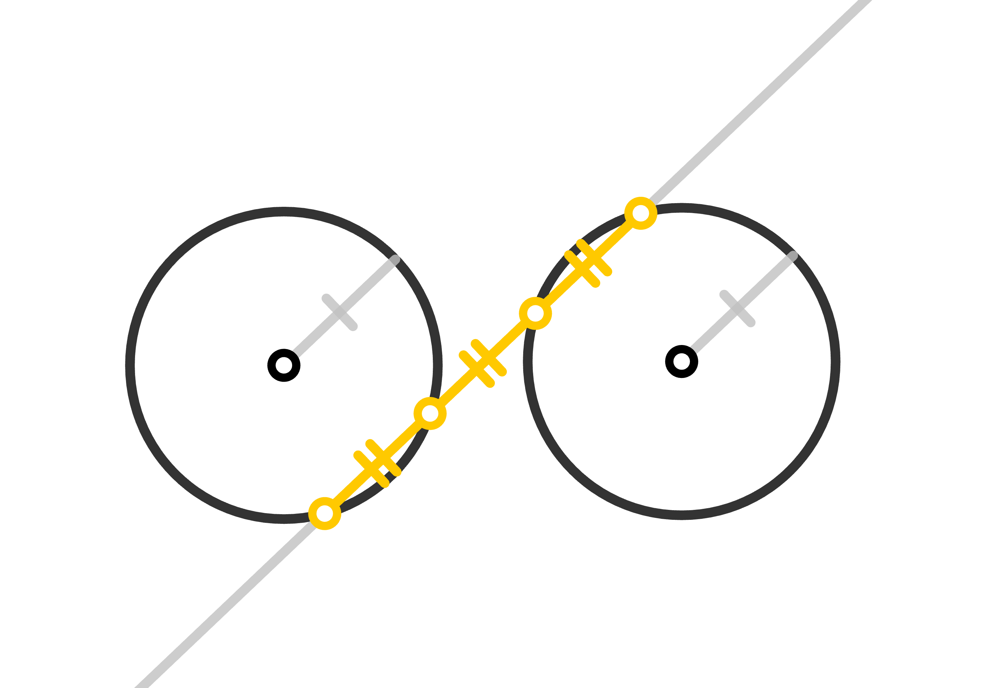
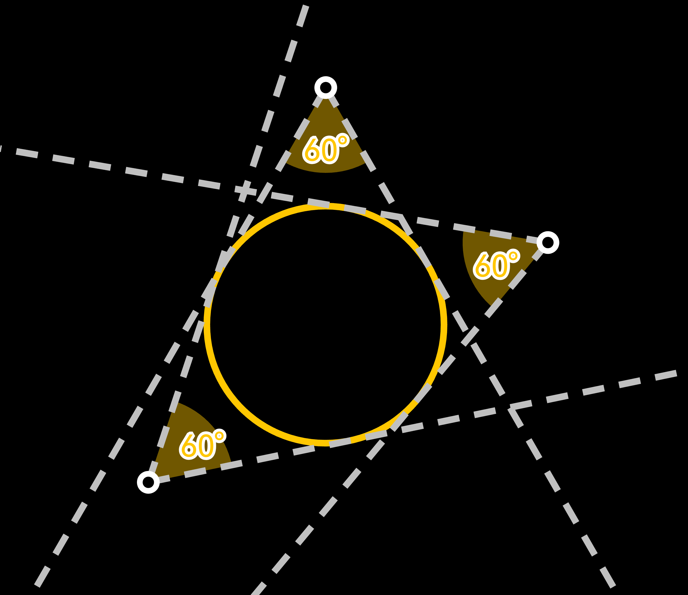

# XEuclidea Puzzle (XEP)

### 1-15

### 16-30

### 31-45

## 套题

Set Similar Puzzles

### Triangle Segments
 

### Hiho
 

### Round
 

### Midpoint Chord

### 3 Equal Segments

### Light and Dark
 

### Summer Contest
 

## *撅沙，吴姐！*

Impossible straightedge and compass constructions.

## *赠予*

Grant

## 草稿箱 

Experiment

### 1-15

### 16-30

### 31-45

