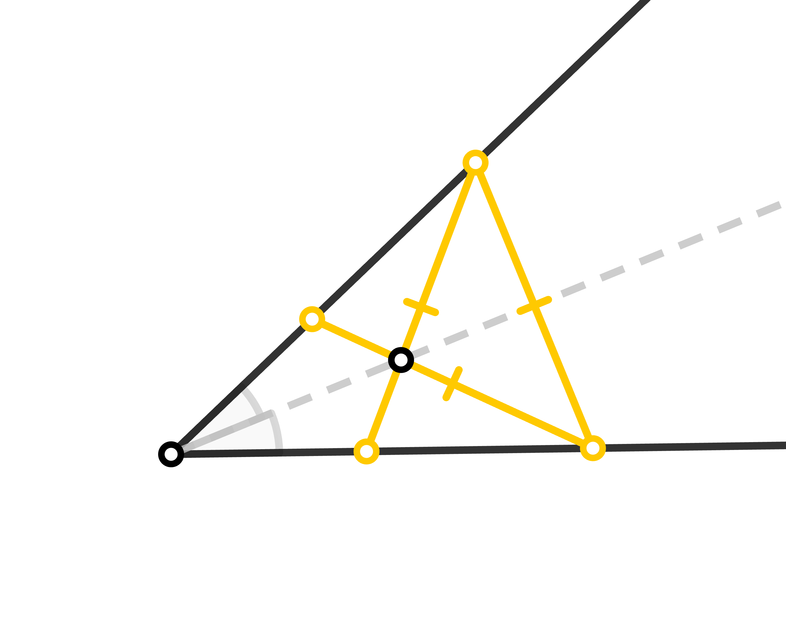

# XEuclidea Puzzle (XEP)

### 1-15

### 16-30

### 31-45

### 46-60

## 套题

Set Similar Puzzles

### Triangle Segments
有关三角形内交于一点的3条等长线段 
Regarding the three equally long line segments that intersect within a triangle at a point 
 

### Hiho
关于平行线的题目 
Regarding parallel lines of puzzles 
 

### Round
关于直径的题目 
Regarding diameter of puzzles 
 

### Midpoint Chord
关于弦的中点 
Regarding the midpoint of the chord 

### 3 Equal Segments
关于三条等长线段的题目 
Regarding three equally long line segments of puzzles 

### Light and Dark
光与影的圆艺 
The Art of Light and Shadow 

 

### Summer Contest
 

### Spring Contest

## *撅沙，吴姐！*

Impossible straightedge and compass constructions.

## *赠予*

Grant

## 草稿箱 

Experiment

### 1-15

### 16-30

### 31-45

### 46-60

